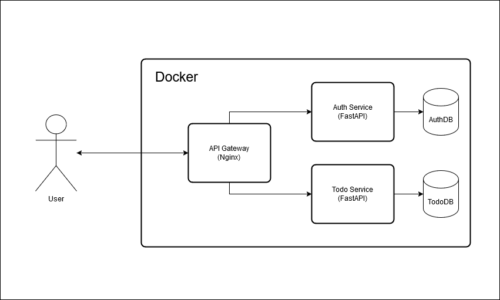

# Todo on Microservices

# Description

Basic Todo application built using microservices architectural pattern.

The application consists of api gateway and 2 microservices: authentication and todo.

### Api Gateway

Simple Nginx server acting as a API Gateway for 2 microservices.

Distributes API calls to the services and serves frontend for the application.

### Authentication Service

This services is responsible for registration and authentication of users.

On successful authentication returns JWT token.

### Todo Service

CRUD application for managing Todo records. Requires authentication on all endpoints.

# Tech Stack

The application was built using the following:

- Python 3.12
- FastAPI
- Postgresql
- Alembic
- SQLModel
- Docker
- docker-compose
- Nginx
- html / css / js

# Running The Application

Running the application requires only 1 command.

`docker-compose up -d`

Open the frontend at localhost in the browser.
